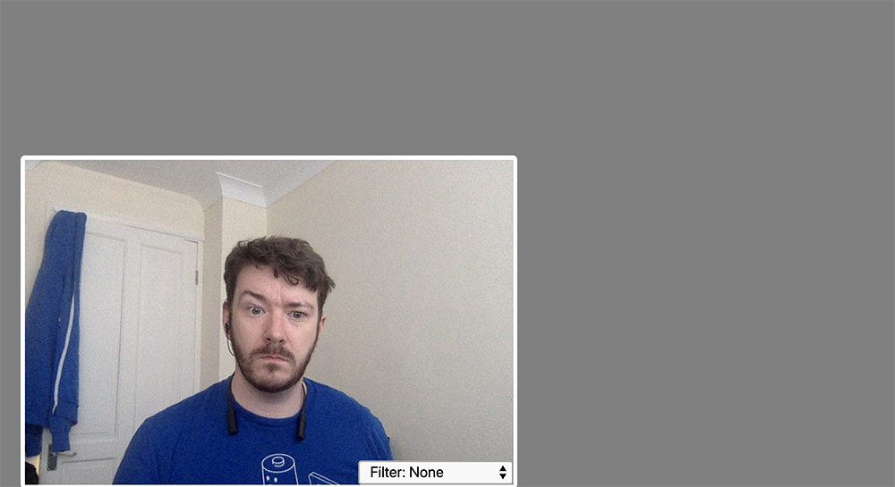
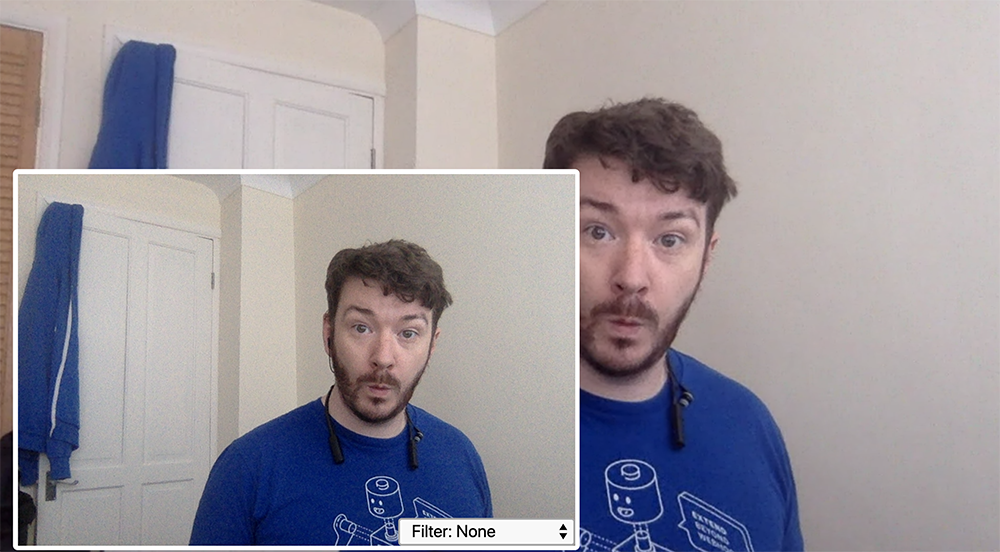
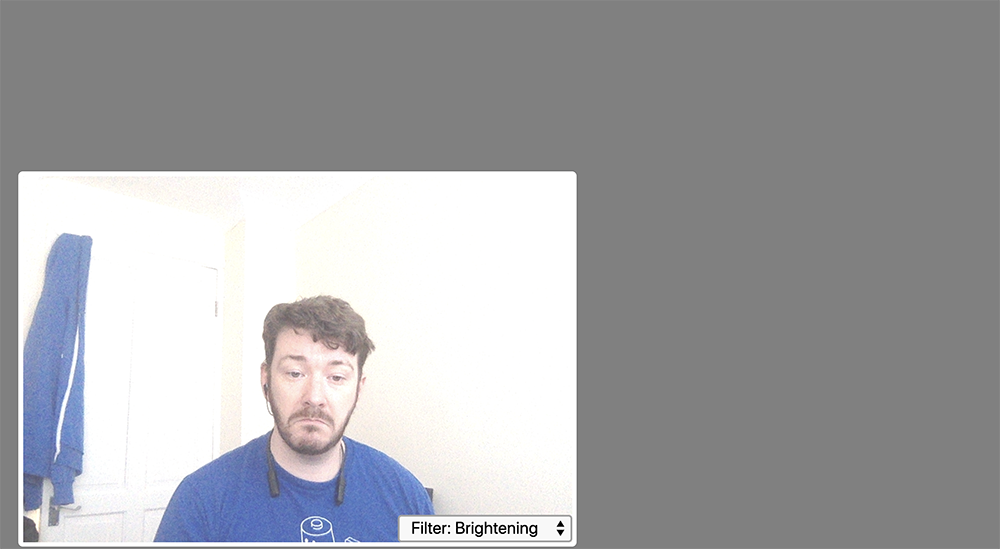
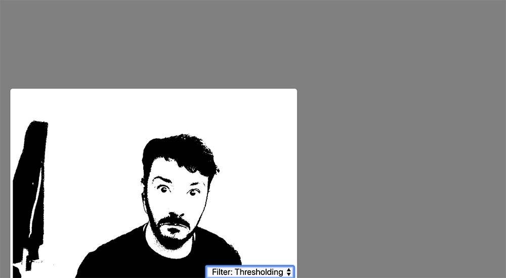
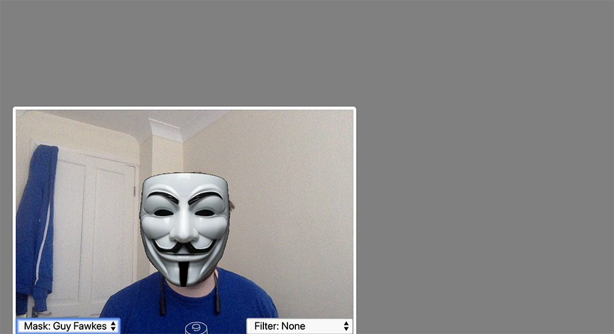
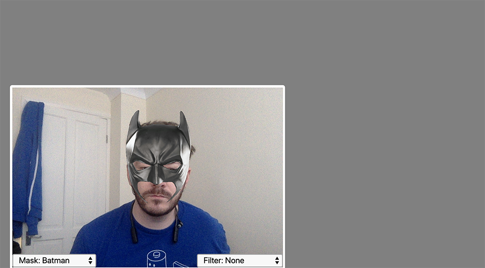

# Video Filters With OpenTok.js and Tracking.js

**TL;DR:** Following this guide, you're going to create a video streaming session between two clients and let them apply filters to their streams.

- [Video Filters With OpenTok.js and Tracking.js](#video-filters-with-opentokjs-and-trackingjs)
  - [TokBox and OpenTok.js](#tokbox-and-opentokjs)
  - [Tracking.js (probably going to change this lib)](#trackingjs-probably-going-to-change-this-lib)
  - [Pre-requisites](#pre-requisites)
    - [Node & NPM](#node--npm)
    - [TokBox Account](#tokbox-account)
    - [Git](#git)
  - [Get Started](#get-started)
    - [Configure the Application](#configure-the-application)
      - [Create a Project](#create-a-project)
      - [Create a Session](#create-a-session)
      - [Generate a Token](#generate-a-token)
      - [Create a Configuration File](#create-a-configuration-file)
      - [Install Dependencies](#install-dependencies)
      - [Run the Application](#run-the-application)
  - [Introducing the Technology](#introducing-the-technology)
    - [OpenTok.js SDK](#opentokjs-sdk)
    - [Tracking.js](#trackingjs)
    - [The Demo Application](#the-demo-application)
  - [Creating Some New Filters](#creating-some-new-filters)
    - [Brightness](#brightness)
    - [Thresholding](#thresholding)
  - [Facial Tracking with Tracking.js](#facial-tracking-with-trackingjs)
    - [Install Tracking.js](#install-trackingjs)
    - [The Guy Fawkes Mask](#the-guy-fawkes-mask)
    - [Be Batman](#be-batman)
  - [In Summary](#in-summary)

## TokBox and OpenTok.js

TokBox produces the WebRTC based OpenTok platform for adding live video, voice & messaging to web and mobile applications. OpenTok.js is the JavaScript SDK for the OpenTok platform. We'll use OpenTok.js for connecting from our application to a video streaming session.

## Tracking.js (probably going to change this lib)

The tracking.js is a lightweight and powerful real time face detection and color tracking library that brings different algorithms and techniques into the browser environment. We'll use tracking.js to track faces so we can apply masks.

## Pre-requisites

This is what you'll need to follow this tutorial.

### Node & NPM

To get started you're going to need node and the node package manager (npm) installed. Let's check if they're installed by running:

```bash
node --version
```

```bash
npm --version
```

If you don’t have node and npm installed, check out [nodejs.org and install the correct version for your operating system](https://nodejs.org/en/). I wrote this article with Node 11.8 and NPM 6.8.

### TokBox Account

Head over to [TokBox to sign up for a free trial](https://tokbox.com/account/user/signup).

### Git

See if you have Git installed.

```bash
git --version
```

If not, Atlassian have a guide on how to [install Git](https://www.atlassian.com/git/tutorials/install-git). I wrote this article with Git 2.17 installed.


## Get Started

As a base I have prepared a version of the application, from [OpenTok web samples](https://github.com/opentok/opentok-web-samples) for stream filters, that you can edit.

Check out [my version of the OpenTok web filter samples here](https://github.com/lukeocodes/opentok-web-samples-extra) by running the following command in your command line tool of choice, or by using your Git interface to check out this URL: https://github.com/lukeocodes/opentok-web-samples-extra.git

```bash
git clone git@github.com:lukeocodes/opentok-web-samples-extra.git
```

> ***Note:*** The `master` branch is at the start point, but if you're impatient (and like to skip to the end like me) you can `git checkout demo-end` and run the application from there.

### Configure the Application

So, before you start coding, you need to configure the application as it is and get a feel for the starting point. This will need the OpenTok account mentioned in the pre-requisities. If you don't have one, head over to [TokBox to sign up](https://tokbox.com/account/user/signup) now.

#### Create a Project

Once you've confirmed your email address and logged in, you'll be able to click on **Create Project** from your [account overview](https://tokbox.com/account/#/). Create a new OpenTok API project by clicking on **Create Custom Project**. Give your project a name and click on **Create**.

Now, make a note of your *API KEY* and *SECRET* for the config step.

#### Create a Session

Having created your project, you'll be redirected to the project dashboard. Scroll down to *Project Tools* and click on **Create Session ID**. You could also choose between *Relayed* and *Routed*. Basically, *Relayed* attempts a peer-to-peer connection but will use relay servers when firewalls block peer-to-peer. *Routed* is the default where streams go to the OpenTok Media Router. You can [read more about sessions in the documention](https://tokbox.com/developer/guides/create-session/).

Make a note of the *SESSION ID* that gets created.

#### Generate a Token

Before we configure the application, we need to generate a token. On your project dashboard, under *Project Tools* (the same section where you created your session ID), enter the *SESSION ID* you just generated and click **Generate token**.

Make a note of the *GENERATED TOKEN* for the next step.

#### Create a Configuration File

Make a copy of `js/config.js.example` and save it as `js/config.js` (in the js directory) making sure to modify the values to those from your TokBox account.

*API KEY*, *SESSION ID* and *TOKEN* are all created above. If you are running the application locally using `npm start`, you will need a *BASE URL* of `http://127.0.0.1:8080`. For something like Heroku, it's more like `https://app-name.herokuapp.com`.

> ***Quick Tip:*** If you're running the application having run `npm start` you can stop it again with CTRL+C.

Your `js/config.js` will end up looking something like this.

```js
// js/config.js
(function closure(exports) {
  exports.BASE_URL = 'base url';
  exports.API_KEY = 'api key';
  exports.SESSION_ID = 'session id';
  exports.TOKEN = 'token';
})(exports);
```

#### Install Dependencies

Now use npm to install your dependencies. Run this from inside your project directory.

```bash
npm install
```

#### Run the Application

You can start the application by using `npm start`. This is a smart little function. If you don't configure a custom start script in `package.json`, this will assume you mean `node index.js` where `index.js` is the main file configured in `package.json`. In our case, it's going to run `./node_modules/bin/http-server` to start our node based web server.

```bash
npm start
```

Once up and running you can view the session locally by opening [localhost:8080](http://127.0.0.1:8080) in your favourite browser. It should look something like, but with you instead of me.



Now, load the same URL in another browser window so you can talk to yourself!

> ***Important note:*** I don't always look so scruffy :)  



## Introducing the Technology

The OpenTok platform makes it easy to embed real-time, high-quality interactive video, messaging, screen-sharing, and more into web and mobile apps. Here, specifically we'll be using the JavaScript Client SDKs.

### OpenTok.js SDK

The JavaScript Client SDK is doing the real heavy lifting. It's going to use hardcoded credentials to connect to a session using a token we generate in the developer portal. It's then going to subscribe to and publish audio-video streams in our browser.

### Tracking.js

Tracking.js is a lightweight JavaScript library for tracking facial positions inside images and video. We're going to retreive the co-ordinates on the canvas 

### The Demo Application

The application you've cloned and started comes pre-built with some filters already. These filters work by using image data from the [Canvas API](https://developer.mozilla.org/en-US/docs/Web/API/Canvas_API) and modifying it. The image data is in an object containing width, height and pixel data. The pixel data is contained in an array. Every 4 items represent a pixels R, G, B and A respectively.

So applying image effects can work by modifying the RGBA data.

Here is a hacky example. The code is explained using comments, but it won't actual run.

```js
// The existing image data.
const imgData = new ImageData(existingData, width, height);

// An empty typed data array for our new modified image data
const dataArray = new Uint8ClampedArray(imgData.data.length);

// Loop over the data, skipping to every 4th item.
for (let i = 0; i < imgData.data.length; i += 4) {
  // i is R / red
  // i+1 is G / green
  // i+2 is B / blue
  // i+3 is alpha - which specifies the opacity of the color.

  // here, we're addoing 80 to the relative channel value, effectively lighting this channel
  dataArray[i] = imgData.data[i] + 80;
  dataArray[i + 1] = imgData.data[i + 1] + 80;
  dataArray[i + 2] = imgData.data[i + 2] + 80;
  // lightening every channel will result in a whitewashed/brightened effect

  dataArray[i + 3] = imgData.data[i + 3];
}

return new ImageData(dataArray, imgData.width, imgData.height);
```

You can see the existing filters modifying the RGB values in [`js/filters.js`](https://github.com/lukeocodes/opentok-web-samples-extra/blob/master/js/filters.js).

## Creating Some New Filters

What follows is the steps to edit the application for the creation of two new filters, to adjust the brightness and [thresholding](https://en.wikipedia.org/wiki/Thresholding_(image_processing)) our stream.

### Brightness

Adjusting the brightness of an image is one of the most straight forward image processing operations that can be done. As shown in the earlier code sample, all you need to do is add the desired change in brightness to each of the red, green and blue channels.

Open `js/filters.js` and find the line with the comment `// Brighten` and replace the comment with a new function for our filter.

> ***Quick Tip:*** Comments like `// ...` and `<!-- // ... -->` show that more code exists but has been removed, for the sake of clarity, here in the blog.

```js
// js/filters.js
(function closure(exports) {
  var Filters = {

    // ...

    brighten: function brighten(imgData) {
      // New data

      // Loop 

      // Return
    }
  };

  // ...
})(exports);
```

The image data in an 8 bit unsigned clamped array. This means it has a fixed length and the values are clamped to unsigned values between 0-255. Perfect for RGB values. So we need to create a new, empty, 8 bit array that we'll store our modified image data in. Replace `// New data` as shown here, where you're setting the fixed length with the length of the existing data.

```js
// js/filters.js
    // ...

    brighten: function brighten(imgData) {
      const res = new Uint8ClampedArray(imgData.data.length);

      // Loop 

      // Return
    }

    // ...
```

Now, to loop over the existing data and shift the values to apply a brightening effect. Replace `// Loop` as shown here. And, as explained earlier in the article, you're looping over the data, skipping to every 4th index in the array.

```js
// js/filters.js
    // ...

    brighten: function brighten(imgData) {
      const res = new Uint8ClampedArray(imgData.data.length);

      for (let i = 0; i < imgData.data.length; i += 4) {
        var inputRed = imgData.data[i];
        var inputGreen = imgData.data[i + 1];
        var inputBlue = imgData.data[i + 2];
        res[i] = inputRed + 80;
        res[i + 1] = inputGreen + 80;
        res[i + 2] = inputBlue + 80;
        res[i + 3] = imgData.data[i + 3];
      }

      // Return
    }

    // ...
```

Last of all, for this function, you'll return the new data array. Replace `// Return` as shown.

```js
// js/filters.js
    // ...

    brighten: function brighten(imgData) {
      const res = new Uint8ClampedArray(imgData.data.length);

      for (let i = 0; i < imgData.data.length; i += 4) {
        var inputRed = imgData.data[i];
        var inputGreen = imgData.data[i + 1];
        var inputBlue = imgData.data[i + 2];
        res[i] = inputRed + 80;
        res[i + 1] = inputGreen + 80;
        res[i + 2] = inputBlue + 80;
        res[i + 3] = imgData.data[i + 3];
      }

      return new ImageData(res, imgData.width, imgData.height);
    }

    // ...
```

With your function set up, now you need to be able to select it. So open `index.html` and replace `<!-- Brighten -->` with an option to select our new function.

```html
<!-- index.html -->
<!-- // ... -->
          <select id="filter">
            <option value="none">Filter: None</option>
            <option value="grayscale">Filter: Grayscale</option>
            <option value="sepia">Filter: Sepia</option>
            <option value="invert">Filter: Invert</option>
            <option value="brighten">Filter: Brightening</option>
            <!-- Threshold -->
          </select>
<!-- // ... -->
```

Now, start the application again opening [localhost:8080](http://127.0.0.1:8080) and check out the new brightening filter. The `option` value is the same as the function name.

```bash
npm start
```



### Thresholding

Next up, is thresholding the image.

Open `js/filters.js` and find the line with the comment `// Threshold` and replace it with the following function. This time, you have the whole function.

How thresholding works, is that we replace the colour with white or black based on a algorythm involving the sum of the values of the red, green and blue channels. A calculated sum over 100 (`>= 100`), or the brighter colours, is made white. Everything else is made black.

```js
// js/filters.js
(function closure(exports) {
  var Filters = {

    // ...

    threshold: function threshold(imgData) {
      const res = new Uint8ClampedArray(imgData.data.length);
      for (let i = 0; i < imgData.data.length; i += 4) {
        var inputRed = imgData.data[i];
        var inputGreen = imgData.data[i+1];
        var inputBlue = imgData.data[i+2];
        var v = (0.2126 * inputRed + 0.7152 * inputGreen + 0.0722 * inputBlue >= 100) ? 255 : 0;
        res[i] = res[i+1] = res[i+2] = v;
        res[i + 3] = imgData.data[i + 3];
      }

      return new ImageData(res, imgData.width, imgData.height);
    }

  };

  // ...
})(exports);
```

Now to add an option to select thresholding. So open `index.html` and replace `<!-- Threshold -->` with an option to select our new function.

```html
<!-- index.html -->
<!-- // ... -->
          <select id="filter">
            <option value="none">Filter: None</option>
            <option value="grayscale">Filter: Grayscale</option>
            <option value="sepia">Filter: Sepia</option>
            <option value="invert">Filter: Invert</option>
            <option value="brighten">Filter: Brightening</option>
            <option value="threshold">Filter: Thresholding</option>
          </select>
<!-- // ... -->
```

Now, start the application again opening [localhost:8080](http://127.0.0.1:8080) and check out the new thresholding filter.

```bash
npm start
```



## Facial Tracking with Tracking.js

Next up, you'll add Tracking.js and render an image over your face like a mask.

### Install Tracking.js

Using npm, install Tracking.js.

```bash
npm i tracking
```

Add the library to your application using the traditional approach. Edit `index.html` and find the comment where it says `<!-- Scripts -->`. Replace this with the new script tags shown below. The first file `tracking-min.js` is the minified Tracking.js library. The second file `face-min.js` is data used by Tracking.js for tracking faces in media. Other data sets such as facial features, including eyes, nose, and mouth, are also available.

```html
<!-- index.html -->
<!-- // ... -->
    <script type="text/javascript">
      var exports = {};
    </script>
    <script src="node_modules/tracking/build/tracking-min.js"></script>
    <script src="node_modules/tracking/build/data/face-min.js"></script>
    <script type="text/javascript" src="js/config.js"></script>
<!-- // ... -->
```

Now, as filters and masks operate slightly differently, I have kept them separate. This is to do with the available objects inside the established `js/filters.js` file.

Create a new file `js/masks.js` and give it the following content to start with.

```js
// js/masks.js
(function closure(exports) {
  var Masks = {
    none: function none(tracker, canvas, ctx) {}

    // Guy Fawkes

    // Batman
  };

  // Set the initial mask to none
  Masks.selectedMask = Masks.none;

  // When the mask selector changes we update the selectedMask
  var maskSelector = document.querySelector('#mask');
  maskSelector.addEventListener('change', function change() {
    Masks.selectedMask = Masks[maskSelector.value];
  });

  exports.Masks = Masks;
})(exports);
```

Open and edit `js/publish.js` and find the `// Tracker.js` comment. Replace that, as shown here.

This object tracker is what will read the media and recognise any faces. Tracking works in general by effectively stepping a "shape" around your media until it finds a near match. The configuration is what sets the starting scale of the "shape" and step size. These will aid to fine tune (and improve the speed of) the tracker. 

> ***Note:*** With my built-in and 720p webcams this configurations tended to work just fine.

```js
// js/publish.js

    // ...
    var reqId;

    // Draw a box around face
    var tracker = new tracking.ObjectTracker('face');
    tracker.setInitialScale(10);
    tracker.setStepSize(2);
    tracker.setEdgesDensity(0.01);

    // ...
```

And in the same file, find the `// apply Mask` comment and replace that like this.

```js
// js/publish.js

      // ...
      ctx.putImageData(imgData, 0, 0);

      exports.Masks.selectedMask(tracker, canvas, ctx);

      // ...
```

Edit `index.html` and find both `<!-- Masks -->` comments. 

To keep masks separate, you'll also create a separate select box. We'll leave the selections empty, for now. 

You also need to include the new `js/masks.js` file here.

```html
<!-- index.html -->
<!-- // ... -->
    <div id="videos">
        <div id="subscriber"></div>
        <div id="publisher">
          <!-- // ... -->
          <select id="mask">
            <option value="none">Mask: None</option>
            <!-- Guy Fawkes -->
            <!-- Batman -->
          </select>
        </div>
    </div>
    <!-- // ... -->
    <script type="text/javascript" src="js/filters.js"></script>
    <script type="text/javascript" src="js/masks.js"></script>
<!-- // ... -->
```

Before you run it, there is some styling to apply to the masks select box. Edit `css/app.css` and find the comment `/* Masks menu css */` and replace it with the following CSS.

```css
/* css/app.css */
/* // ... */
#mask {
  position: absolute;
  bottom: 0;
  left: 0;
  z-index: 102;
}
```

You've not created any masks yet, but start the application again opening [localhost:8080](http://127.0.0.1:8080) to check you haven't made any errors. If the stream works, you're on the right track.

```bash
npm start
```

### The Guy Fawkes Mask

The first mask will be Guy. The Guy Fawkes mask has become a symbol of anonimity. Which, is the point of wearing a mask!

Open `js/masks.js` and find the comment `// Guy Fawkes`. Replace the comment with the new function.

```js
// js/masks.js
// ...
(function closure(exports) {
  var Masks = {
    none: function none(tracker, canvas, ctx) {},

    guy: function guy(tracker, canvas, ctx) {
      // Load an image

      // Start tracking

      // Apply our image as a mask
    }

    // Batman
  };
// ...
```

Load the image you want to place over any faces found by the tracker, replacing the `// Load an image` comment as shown here.  `../images/guy.png` should be available from the repository.

```js
// js/masks.js

    // ...
    guy: function guy(tracker, canvas, ctx) {
      var mask = document.createElement("img");
      mask.src = '../images/guy.png';  

      // Start tracking

      // Apply our image as a mask
    }
    // ...
```

Now, enable tracking against our media. The media you're using is the canvas stream. You need to enable camera and audio, here. Replace the `// Start tracking` comment like this.

```js
// js/masks.js

    // ...
    guy: function guy(tracker, canvas, ctx) {
      var mask = document.createElement("img");
      mask.src = '../images/guy.png';

      tracking.track(canvas, tracker, { camera: true, audio: true });

      // Apply our image as a mask
    }
    // ...
```

You need register an event listener against the `track` event of the tracker, so that when it finds a face, it can draw the mask over the detected face.

```js
// js/masks.js

    // ...
    guy: function guy(tracker, canvas, ctx) {
      var mask = document.createElement("img");
      mask.src = '../images/guy.png';  

      tracking.track(canvas, tracker, { camera: true, audio: true });

      tracker.on('track', function(event) {
        event.data.forEach(function(rect) {
          ctx.drawImage(mask, rect.x - 100, rect.y - 100, rect.width * 1.5, rect.height * 1.5);
        });
      });
    }
    // ...
```

Now, you need to add the option for the Guy mask to the application. Edit `index.html`, look for the `<!-- Guy Fawkes -->` comment and add the option as shown below.

```html
<!-- index.html -->
<!-- // ... -->
    <div id="videos">
        <div id="subscriber"></div>
        <div id="publisher">
          <!-- // ... -->
          <select id="mask">
            <option value="none">Mask: None</option>
            <option value="guy">Mask: Guy Fawkes</option>
            <!-- Batman -->
          </select>
        </div>
    </div>
<!-- // ... -->
```

Fingers crossed, it all works! Start the application again opening [localhost:8080](http://127.0.0.1:8080). Select your first mask and check it out.



### Be Batman

The final mask and edit to our code will be Batman. Open `js/masks.js` and find the comment `// Batman`. Replace the comment with this new function.

```js
// js/masks.js

    // ...

    batman: function batman(tracker, canvas, ctx) {
      var mask = document.createElement("img");
      mask.src = '../images/batman.png';  

      tracking.track(canvas, tracker, { camera: true, audio: true });
      tracker.on('track', function(event) {
        event.data.forEach(function(rect) {
          ctx.drawImage(mask, rect.x - 60, rect.y - 170, rect.width * 1.4, rect.height * 1.5);
        });
      });
    }
    // ...
```

Now add the option for the Batman mask to the application. Edit `index.html`, look for the `<!-- Batman -->` comment and add the option as shown below.

```html
<!-- index.html -->
<!-- // ... -->
    <div id="videos">
        <div id="subscriber"></div>
        <div id="publisher">
          <!-- // ... -->
          <select id="mask">
            <option value="none">Mask: None</option>
            <option value="guy">Mask: Guy Fawkes</option>
            <option value="batman">Mask: Batman</option>
          </select>
        </div>
    </div>
<!-- // ... -->
```

Can I be Batman?? Start the application again opening [localhost:8080](http://127.0.0.1:8080). Select the mask and try it out.



## In Summary

Writing Snapchat filters and wearing masks in video streams is made easier by OpenTok's SDKs. OpenTok also lets you send your streams to platforms like YouTube Live, Twitch and Facebook all at the same time. So, besides being able to build your own live stream site, you can still reach people on other services.